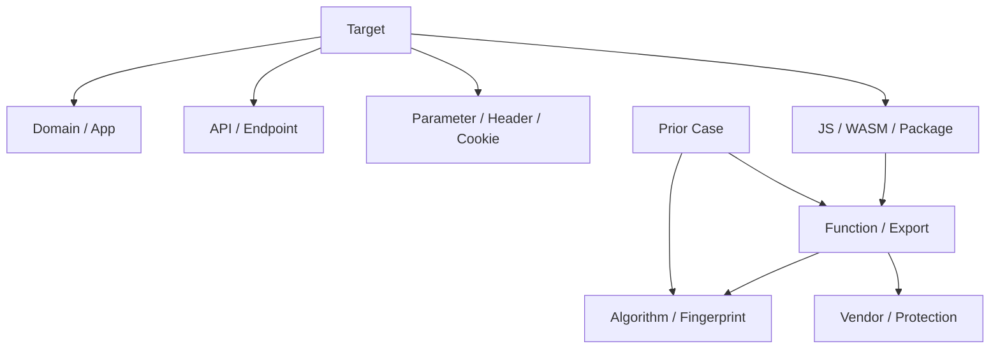

# Intelligence Graph Template

```mermaid
graph TD
  Target["Target"]
  Target --> Domain["Domain / App"]
  Target --> API["API / Endpoint"]
  Target --> Param["Parameter / Header / Cookie"]
  Target --> File["JS / WASM / Package"]
  File --> Function["Function / Export"]
  Function --> Algorithm["Algorithm / Fingerprint"]
  Function --> Vendor["Vendor / Protection"]
  Case["Prior Case"] --> Function
  Case --> Algorithm
```

Use `scripts/build_graph.py` when extracted entity JSON is available.
