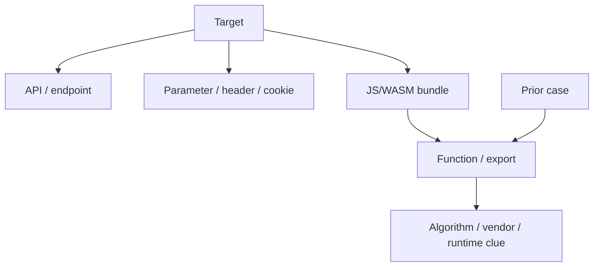

# Web Reverse Intelligence Brief

## Target Profile

- Target:
- Primary type:
- Secondary types:
- Classification confidence:
- Seed aliases:
- Seed parameters, headers, cookies:
- Seed endpoints, bundles, or fingerprints:

## Search Budget

| Budget Item | Limit | Used | Notes |
| --- | ---: | ---: | --- |
| Initial queries | 20 | 0 |  |
| Expansion rounds | 2-3 | 0 |  |
| Queries per node | 5 | 0 |  |
| Evidence cards | 8 | 0 |  |

## Search Rounds

| Round | Query Focus | New Nodes Found | Duplicate/Drift Signal | Decision |
| --- | --- | --- | --- | --- |
| 1 | aliases, target, known parameters |  |  | expand, narrow, or stop |
| 2 | extracted nodes |  |  | expand, narrow, or stop |

## Coverage Matrix

| Source Class | Searched | Useful Hits | Best Lead | Blind Spot |
| --- | --- | ---: | --- | --- |
| General search | yes/no | 0 |  |  |
| Code search | yes/no | 0 |  |  |
| Domestic forums/blogs | yes/no | 0 |  |  |
| International communities | yes/no | 0 |  |  |
| Package registries | yes/no | 0 |  |  |
| Archives/cache | yes/no | 0 |  |  |
| Video/social pointers | yes/no | 0 |  |  |

## Negative Intelligence

| No-Hit Area | Terms/Sources Searched | Expanded Alternative |
| --- | --- | --- |
|  |  |  |

## Best Evidence

| Grade | Source | Date | Source Weight | Technical Similarity | Confidence | Freshness Risk | Reuse Risk | Why It Matters |
| --- | --- | --- | ---: | ---: | ---: | --- | --- | --- |
| A/B/C/D |  |  |  |  | 0.00 | low/medium/high | low/medium/high |  |

## Conflicts

| Conflict | Preferred Lead | Likely Explanation | Live Check |
| --- | --- | --- | --- |
|  |  | version migration / endpoint split / weak evidence |  |

## Stale Intelligence

| Case | Why It May Be Stale | Useful Clues Left | Live Check |
| --- | --- | --- | --- |
|  |  |  |  |

## Intelligence Graph

## Recommended Investigation Priorities

| Priority | Action | Reason | Validation Step |
| --- | --- | --- | --- |
| P1 |  | most correlated evidence |  |
| P2 |  | possible migration or conflict |  |
| P3 |  | indirect but useful clue |  |
